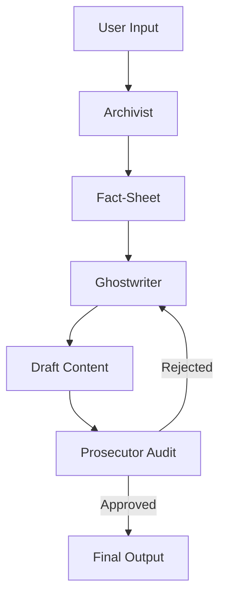

# 🏛️ Sentinel Assembly v2.0

### *Self-Correcting Multi-Agent Content Governance Engine*

<p align="center">
  
  
  
</p>

---

## ✦ Overview

Sentinel Assembly is an adversarial AI middleware designed to generate **fact-verified, audit-compliant content** through a structured, self-correcting pipeline.

Unlike traditional generation systems, it enforces **recursive validation**, ensuring outputs are continuously audited before approval.

---

## ✦ Core Concept

> **“Generate → Challenge → Correct → Approve”**

A closed-loop architecture where **no output escapes verification**.

---

## ✦ Architecture: Recursive Consensus Model

<p align="center">
  
</p>

### 🧠 AGT-01 — Archivist

* Extracts structured facts
* Builds deterministic **Fact-Sheet**
* Flags ambiguity

---

### ✍️ AGT-02 — Ghostwriter

* Generates multi-format content
* Strictly bound to Fact-Sheet
* Supports tone/personality control

---

### ⚖️ AGT-03 — Prosecutor

* Audits for hallucinations
* Enforces factual consistency
* Issues correction directives

---

## 🔁 Recursive Validation Loop (Core Innovation)

```text
Draft → Audit → Reject → Correct → Re-Audit → Approve
```

✔ No bypass
✔ No unchecked output
✔ No hallucination tolerance

---

## ⚙️ System Flow



---

## 🛠️ Tech Stack

| Layer     | Technology        |
| --------- | ----------------- |
| Frontend  | React + Vite      |
| Backend   | Node.js + Express |
| Database  | MySQL             |
| Auth      | JWT               |
| AI Engine | OpenRouter        |

---

## ✨ Key Features

* 🧠 Multi-agent AI pipeline
* 🔁 Recursive self-correction
* ⚖️ Hallucination detection
* 📊 Real-time audit logs
* 🎭 Persona-based generation
* 🔐 Secure authentication
* 📂 Mission history tracking


---

## 🛡️ Operational Guarantees

✔ Deterministic grounding
✔ Mandatory validation
✔ Transparent audit trail
✔ Controlled generation

---

## 📁 Structure

```
client/     → UI
server/     → API + Agents
docs/       → Approach Document
```


---

## 🔐 Security

* .env protected
* JWT sessions
* API key isolation

---

## 📌 Status

<p align="center">
  
  
  
</p>

---

